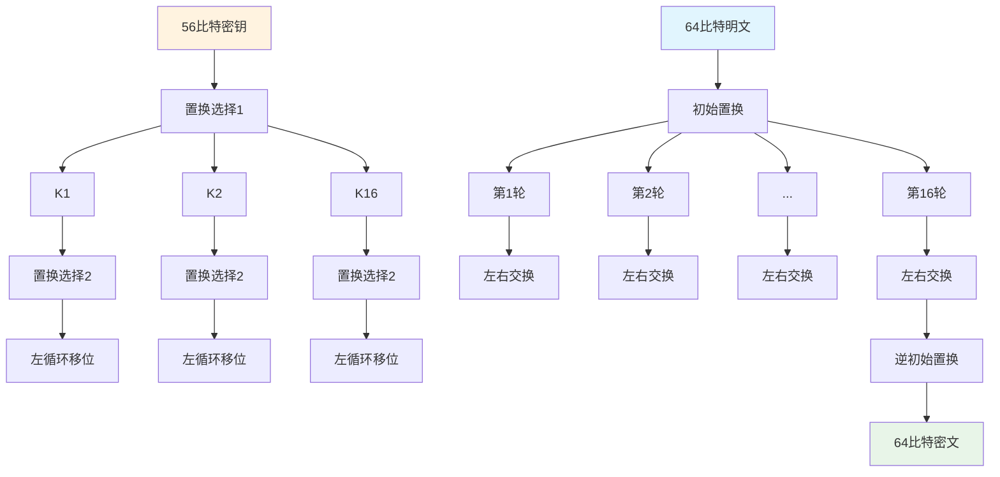
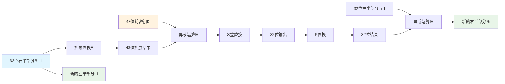
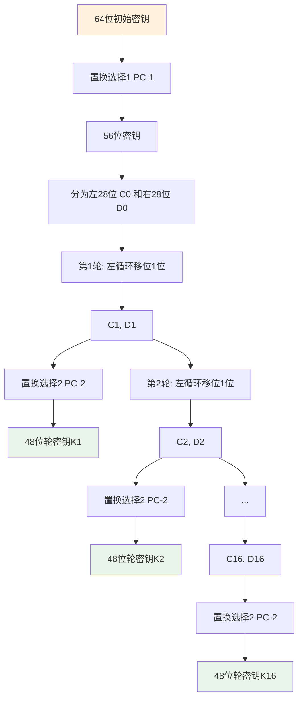

DES 架构
# 总体流程

## DES加密流程图

```mermaid
flowchart TD
    A[64比特明文] --> B[初始置换]
    B --> C[第1轮]
    B --> D[第2轮]
    B --> E[...]
    B --> F[第16轮]
    
    G[56比特密钥] --> H[置换选择1]
    H --> I1[K1]
    H --> I2[K2]
    H --> I16[K16]
    
    I1 --> J1[置换选择2]
    I2 --> J2[置换选择2]
    I16 --> J16[置换选择2]
    
    J1 --> K1[左循环移位]
    J2 --> K2[左循环移位]
    J16 --> K16[左循环移位]
    
    C --> L1[左右交换]
    D --> L2[左右交换]
    E --> L3[左右交换]
    F --> L16[左右交换]
    
    L16 --> M[逆初始置换]
    M --> N[64比特密文]
    
    style A fill:#e1f5fe
    style N fill:#e8f5e8
    style G fill:#fff3e0
```

## 详细加密轮函数

```mermaid
flowchart LR
    A[32位右半部分Ri-1] --> B[扩展置换E]
    B --> C[48位扩展结果]
    D[48位轮密钥Ki] --> E[异或运算⊕]
    C --> E
    E --> F[S盒替换]
    F --> G[32位输出]
    G --> H[P置换]
    H --> I[32位结果]
    J[32位左半部分Li-1] --> K[异或运算⊕]
    I --> K
    K --> L[新的右半部分Ri]
    A --> M[新的左半部分Li]
    
    style A fill:#e1f5fe
    style D fill:#fff3e0
    style L fill:#e8f5e8
    style M fill:#e8f5e8
```

## 密钥扩展流程

```mermaid
flowchart TD
    A[64位初始密钥] --> B[置换选择1 PC-1]
    B --> C[56位密钥]
    C --> D[分为左28位 C0 和右28位 D0]
    
    D --> E1[第1轮: 左循环移位1位]
    E1 --> F1[C1, D1]
    F1 --> G1[置换选择2 PC-2]
    G1 --> H1[48位轮密钥K1]
    
    F1 --> E2[第2轮: 左循环移位1位]
    E2 --> F2[C2, D2]
    F2 --> G2[置换选择2 PC-2]
    G2 --> H2[48位轮密钥K2]
    
    F2 --> E3[...]
    E3 --> F16[C16, D16]
    F16 --> G16[置换选择2 PC-2]
    G16 --> H16[48位轮密钥K16]
    
    style A fill:#fff3e0
    style H1 fill:#e8f5e8
    style H2 fill:#e8f5e8
    style H16 fill:#e8f5e8
```

# 分模块分析