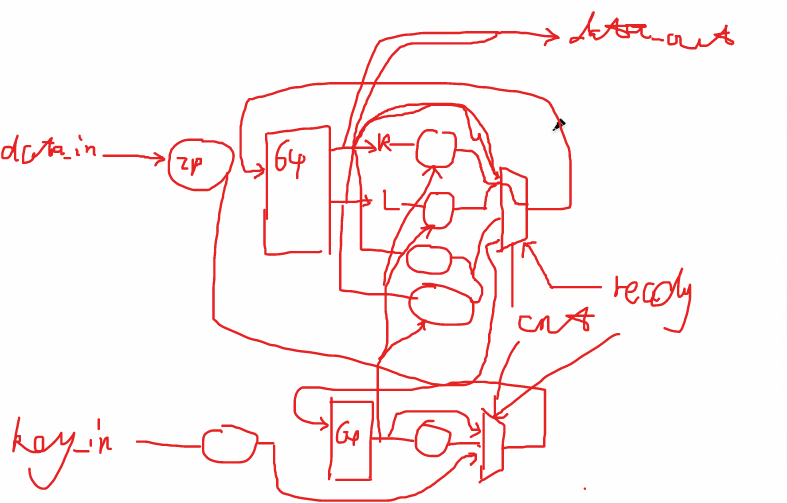

# 对DES的优化

## 需要优化的部分

老师推荐的逻辑

### 寄存器使用
- 需要减少寄存器的使用，多使用组合逻辑和对现有寄存器迭代
- 注意是描述硬件的语言，可以通过数据选择器使得只选择有用的信号

### 值的初始化
- 尽量不使用initial对值进行初始化，也不要通过存储寄存器的方式来完成IP置换等操作
- 可以通过组合逻辑来完成IP置换等操作，避免使用寄存器存储中间结果

### 代码结构
- 少用for循环之类的语句，不要用软件编程的逻辑(例如在处理之前的f_output输出时使用generate导致f_output有一位赋值失败变成X)

