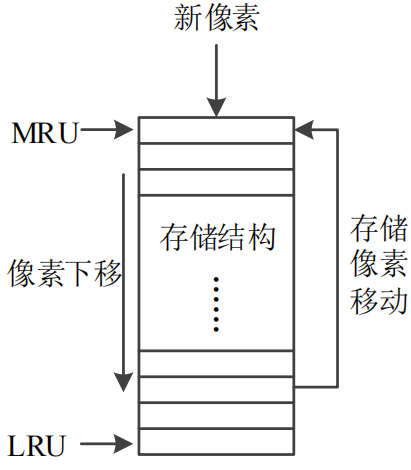
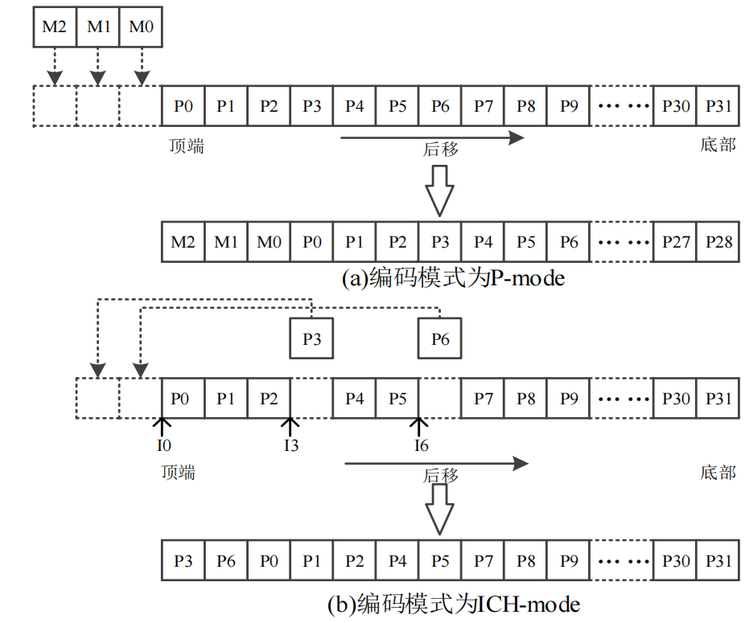
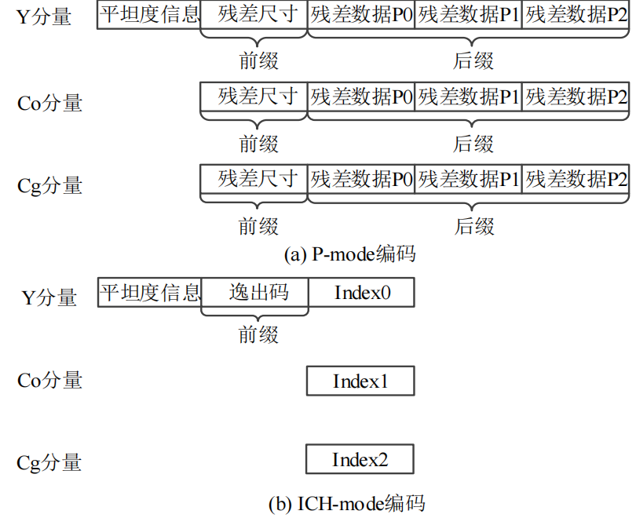
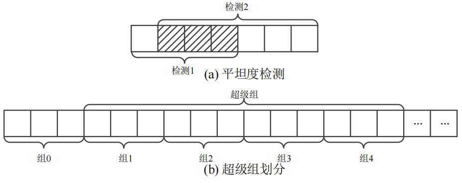

# 本模块旨在设计一个基于DSC1.1标准的编码模块
## 结构分析
编码器模块包括：
- 色彩空间转换：将RGB转换为YCoCg色彩空间
- 量化、预测、重建：
    - 量化：将YCoCg色彩空间中的值量化为DSC1.1标准中的值
    - 预测：根据DSC1.1标准中的预测公式，预测当前像素的YCoCg值
    - 重建：根据DSC1.1标准中的重建公式，重建当前像素的YCoCg值
- VLC熵编码：
    - 统计概率：统计量化后的值出现的概率
    - 构建编码表：根据概率构建编码表
    - 编码：根据编码表对量化后的值进行编码
- 码率控制：
    - 码率计算：根据DSC1.1标准中的码率计算方法，计算码率
    - 码率调整：根据码率计算结果，调整码率
- 平坦度判定：
    - 平坦度计算：根据DSC1.1标准中的平坦度计算方法，计算平坦度
    - 平坦度判断：根据平坦度计算结果，判断是否为平坦区域
    - 输出QP调节到码率控制模块
- 码流复用：
    - 码流组织：根据DSC1.1标准中的码流组织方法，组织码流
    - 码流输出：将码流输出为DSC1.1标准中的格式
- 速率缓存：
    - 缓存管理：根据DSC1.1标准中的缓存管理方法，管理缓存
    - 缓存更新：根据码率控制模块的输出，更新缓存
## 分结构解析逻辑
### 色彩空间转换
在DSC算法中，将由RGB三个分量组成的图像通过线性转换成为亮度和色度的Y、Co、Cg分量，
分量转换公式为
$$
\begin{aligned}
cscCo = R - B \\
cscCg = G - t \\
t = B+(cscCo>>1) \\
Y = t+(cscCg>>1) \\
Co = cscCo + (1<<bits\_per\_component) \\
Cg = cscCg + (1<<bits\_per\_component) \\
\end{aligned}
$$
其中bits_per_component是代表原始像素分量位数的常量，对于位数为8的像素，该值为256

### 预测、量化、重建
预测量化重建模式也称P-mode
- 预测操作通过相邻像素计算得到预测值
- 与原始值做差得到残差值
- 量化操作是对残差值的进一步处理，生成比特数较小的量化残差值
- 重建操作通过预测值与反量化残差值相加得到重建值
#### 预测
与很多其他的视频编码方式类似，利用同一图像内邻近像素点之间存在空间相关性的特点，运用周围像素值信息来预测本组的像素值。
在不同的预测模式下，预测图像与原始图像相减得到的预测残差值差别很大，直接影响后续的熵编码。
预测分为三种模式，这三种模式分别称为
- 改进的自适应中值预测(Modified Median Adaptive Prediction, MMAP)
- 块预测(Block Prediction, BP)
- 中点预测(Mid-point Prediction, MPP)
可针对不同的输入内容，选择合适的预测方式。
##### MMAP
MMAP 预测是建立在中值自适应预测(Median Adaptive Prediction，MAP)基础上的优化，
MAP预测是利用当前组周围已重建的像素值来预测当前组的像素值，该方法被运用到一些编码电路中，
例如JPEG_LS，其运用到了上下行相邻的三个像素，通过比较 a、b、c 值获得预测值，其式如下所
示，预测值𝑝处于 a、b、c 最大值与最小值之间。
- MAP:
    |c|b|
    |--|--|
    |**a**|**p**|
    
    $$
p = Median(a,b,a+b-c)
$$
- MMAP:
    |g|c|b|d|e|f|
    |--|--|--|--|--|--|
    |**x**|**a**|**p0**|**p1**|**p2**||

    如果当前组位于每一行的第一组，则上一行重建值对最左边像素进行复制扩展，即 g、c 和 b 值相同
    如果位于每一行的最后一组，则上一行重建值对最右边像素进行复制，即 f 复制 e 值。
    - MMAP 相比于MAP而言，在预测前先对**上一行重建值**进行**滤波**操作，再重新生成**参考值**
    - 通过对 c、b、d、e 运用[0.25, 0.5, 0.25]水平方向的低通滤波器进行滤波，产生相应的滤波像素filtC，filtB，filtD，filtE，公式如下
    $$
    filtB = (c+2b+d+2)>>2
    $$
    - 滤波后的像素和重建像素混合产生预测参考值，公式如下
    $$
    blendB = b+Median(filtB-b,(-\frac{q_l}{2}),\frac{q_l}{2})
    $$
    - 这一组中三个像素的预测值$p_0,p_1,p_2$计算方式如下，其中$R_0,R_1$分别为$p_0,p_1$反量化后的残差值，$blendC...,filtC...$计算方式同上
    $$
    \left\{
    \begin{aligned}
    p_0 = Median(a+blendB-blendC,a,blendB) \\
    p_1 = Median(a+blendD-blendC+R_0,Min(a,blendB,blendD),Max(a,blendB,blendD)) \\
    p_2 = Median(a + blendE-blendC+R_0+R_1,Min(a,blendB,blendD,blendE),Max(a,blendB,blendD,blendE))
    \end{aligned}
    \right.
    $$
    - 当待预测像素组处于第一行时，由于其上一行没有重建像素，因此其仅采用前一组的重建像素进行预测，如下所示，其中 cpntBitDepth 表示转化后像素分量的位深度，对于本文设计，亮度分量像素的位深为 8bits，色度分量为 9bits，因此预测像素值的限制范围分别为[0, 255]和[0, 511]。
    $$
    \left\{
    \begin{aligned}
    p_0 = a \\
    p_1 = Median(a+R_0,0,(1<<cpntBitDepth)-1) \\
    p_2 = Median(a+R_0+R_1,0,(1<<cpntBitDepth)-1)
    \end{aligned}
    \right.
    $$
##### BP
BP计算较为复杂，先不解释

##### MMP
预测值与原始像素之间一般相差不大，用来表示预测残差值的位数不会过大，但是可能出现特殊情况使得残差值过大，比如一个比特深度为 8 的像素分量，其预测残差值最大可能为-255，需要用 9 比特表示，比原始像素的比特深度还要大，达不到压缩的目的。

因此需要采用 MPP 预测，对最大残差尺寸进行限制，其方法是选择分量有效范围中点值作为预测当前分量组的预测样点，如图 2-5(a)所示，"> <"内$p_0,p_1,p_2$表示待预测像素组，$a_2$表示参考像素值，当待预测像素组处于每行非第一组位置时，利用前一组最右边重建像素值 a2进行预测，一组中 3 个预测像素值相等。
|a0|a1|>a2|p0|p1|p2<|
|--|--|--|--|--|--|

如表所示，如果待预测组为每行的第一组，其采用的参考像素值为上一行的最后一个像素($a_2$)，当待预测组为每片 slice 的第一组，那么参考像素值设为 0。 MPP 预测方式较简单，但预测精度不高，即该预测模式可能产生较大残差。
|...|...|...|a0|a1|a2|
|--|--|--|--|--|--|
|**p0**|**p1**|**p2**|...|...|...|

MPP预测计算方法如式所示，其中 prevRecon 表示重建像素值，cpntBitDepth 表示当前分量位深。
$$
p = ((1<<(cnptBitDepth-1))+prevRecon\  \&\  (1<<q_l)-1)
$$
#### 量化和重建
在不降低视觉效果的情况下，量化过程可减小图像编码长度，减少视觉恢复中不必要的信息。在DSC 算法中通过 QP 值对视频数据进行压缩调节，量化过程通过将像素的预测值和原始值做差得到残差值。
该值再由 QP 值控制，通过加法和移位实现残差值的调整，量化残差的数值普遍较小，被用于编码。
其中每组 QP 值由码率控制模块控制大小，QP 值映射得到亮度和色度的量化水平，亮度和色度的量化水平可以不同，且亮度的量化水平通常低于色度
量化水平与 QP 值的映射关系如表所示，$q_lY$、$q_lC$分别表示亮度 Y 和色度 Co、Cg 的量化水平。

|QP|qlY|qlC|
|--|--|--|
|0|0|0|
|1|0|1|
|2|0|2|
|3|1|2|
|4|1|3|
|5|2|3|
|6|2|4|
|7|3|4|
|8|3|5|
|9|4|5|
|10|4|6|
|11|5|6|
|12|5|7|
|13|5|8|
|14|6|8|
|15|7|8|

**量化后的残差𝑞r**计算如式(2.8)所示，其中 **r** 表示原始像素和预测像素的差值， 若**ql不为 0**，则残差值调整后会有所减小，**ql越大，减小幅度越大**，其中 offset 为与**量化水平有关的偏移量**，如式(2.9)所示。量化过程对有些预测差值进行了适当的缩小，提高了压缩效率，但是图像的信息熵会略有丢失。反量化是对预测残差值进行一定程度上的还原，但与先前计算得到的预测残差值不一定相等，反量化后的值与预测值相加得到重建值，**重建值的作用是为其余组提供像素预测参考**，其作为一个像素分量，值不会超过最小值 0 和最大值 maxval，用这两值进行限值修正，使得**重建值 recon 落在[0, maxval]之间**。如式(2.10)所示，其中**𝑝𝑙用于表示预测值**。
$$
q_r = 
\left\{
\begin{aligned}
(r+offset)>>q_l,\ r>=0 \\
-(-r+offset)>>q_l,\ r<=0
\end{aligned}
\right. \ \ \ \ \ (2.8)
$$
$$
    \begin{aligned}
    offset = Max(0,\frac{1<<q_l}{2}-1) \ \ \ \ \ (2.9)\\
    recon = Median(p_l+(q_r<<q_l),0,maxval) \ \ \ \ \ \ (2.10)
    \end{aligned}
$$
#### 另一种预测方法———颜色历史索引(ICH-mode)
除了可以对输入的每组像素使用 P-mode 进行预测，DSC 还可采用 ICH-mode。
由于视频或图像数据中相近位置的像素往往相似，因此可以保存最近使用过的重建像素来帮助编码。
如果采用 ICH-mode，在保存的重建值中选择与当前组原始像素值最相似的值作为该模式的重建值，ICH输出所选定像素对应的索
引值到熵编码模块进行后续处理。

- ICH 模块使用深度 32 的存储结构来保存最近使用过的重建像素，通过 5bit($2^5=32$) 索引值可以定位每个像素。
- ICH 对每个存储单元进行管理，其中最近最常使用的 MRU(Most-Recently Used)像素位于顶部存储单元，
最近最少使用的 LRU(Least-Recently Used)位于底部。
- 当前一像素组编码选用 P-mode 时，新的重建像素被添加到顶端，其他像素下移，底部像素移出存储结构；
- 当前一像素组编码选用 ICH-mode 时，无像素添加或移出，**仅像素存储位置**发生改变。

ICH的存储结构以移位寄存器方式进行工作。
1. 如果前一组编码方式给出的信号是P-mode时，那么P-mode下产生的重建值传输进来后，按照像素位置被放置于存储结构的顶端，寄存器中原先存储的像素值依次往下移动三个位置，最尾部的数据因新添进来的像素而逐步移出存储结构。如图2-7所示为ICH寄存器更新方式，上组编码模式不同，更新方式不同。图(a)为上组编码为P-mode时存储结构更新情况，其中M0、M1、M2表示P-mode下产生的新像素重建值，P0~P31表示更新前存储结构中的重建像素值，MO、M1、M2按像素位置被添至顶端，PO~P28依次后移，**P29~P31被移出**。
2. 如果上组编码方式选择的是ICH-mode,那么更新方式较P-mode更复杂，被引用的索引值对应的重建值被提取到存储结构顶端，地址小于被引索引值所对应的像素值都要依次下移。例如图(b)中，当ICH-mode下得到的三个像素值分别为**PO、P6和P3**,其对应的第一个、第二个和第三个索引值依次为I0、I6和I3,按索引值顺序对存储结构中的像素进行移动，因为像素P0已处于顶端，不造成像素后移，接着像素P6被提至顶端，地址小于I6的存储单元中数据都后移一个位置，像素P3操作与P6一致，将像素P3移到顶端，地址小于I3的存储单元中像素要再后移一个位置。**如果索引值中存在两个或以上的相等值，相等的索引值中处于前面的值被忽略，用后面不同的索引值进行存储结构的移位操作**，当三个像素值分别变为P3、P6和P3时，其对应索引值变为I3、I6和I3,由于第一个和第三个索引值相等，**因此第一个索引值不考虑，根据第三个索引值对P3进行一次移位**，两个值的移动顺序为**先将像素P6提至顶端**，再**将像素P3提至顶端**，其他像素依照存储单元的地址与索引值I6、I3的大小关系进行相应移动。虽然这两种情况更新后的寄存器中像素是一样的，但两者对应不同的索引值和移动方式。

### VLC熵编码
熵编码是将**包含表示视频序列的一系列信息编码成为一个用来传输或是存储的压缩比特流**。在视频图像压缩编码方面，使用变长编码是对数字多媒体数据进行冗余消除的方法之一。常见的变长编码如H.264采用基于上下文的变长编码(CAVLC)和基于上下文的自适应二进制算术编码(CABAC)两种方式进行编码。与H264标准中的编码算法类似，DSC的熵编码也具有较强的自适应能力，可依据已编码像素情况动态调整编码。
DSC熵编码模块的输入数据流可由P-mode和ICH-mode提供，针对P-mode的输入数据流，采用一种单位增量可变长度编码(Delta Size Unit Variable Length Coding,DSU_VLC)方式；对于ICH-mode会选用一个特殊的逸出码(Special Escape Code)在Y分量进行标注。两种编码方式示意如图2-8所示，三个分量分开进行编码，Y分量最前端放置平坦度指示信息，后面是具体的编码数据，一组中每个分量有三个像素样本，将其采用前缀和后缀的形式编码成一个单元。前缀采用一元码表示(若干变化的“0”位，以“1”位结束),用于指示模式决策和编码所需尺寸，后缀由量化残差数据或ICH索引值组成。图(a)为针对P-mode编码方式，图(b)为针对ICH-mode编码方式。

#### 对p-mode进行编码
DSU_VLC编码方式在实现复杂性、吞吐量和编码效率之间进行了良好的权衡。该编码方式的前缀大小与**量化残差尺寸**有关，对当前组每个**量化残差值映射**得到二进制补码和每个残差值对应的最小尺寸，设$L_{R0}、L_{R1}、L_{R2}$为对应的残差尺寸，则该单元编码所需尺寸LR为三者中的最大值，如式(2.11)所示。$PL_{R0}、PL_{R1}、PL_{R2}$为相同分量的前一组的残差尺寸L,通过式(2.12)可计算得出当前残差的预测尺寸，L还要经过式(2.13)所示过程进一步调整得到最终使用的预测尺寸大小$L_{adj}$,其尺寸大小变化受量化水平变化值q₁_change的影响，计算如式所示，式中Msize为分量允许的最大残差尺寸。
$$
\begin{aligned}
L_R=max(L_{R0},L_{R1},L_{R2})  \ \ \ \ \ \ \ \ (2.11) \\
L=(PL_{R0}+PL_{R1}+2PL_{R2}+2)>>2 \ \ \ \ \ \ \ (2.12) \\
L_{adj} =Median(L-q_{l\_change},0,Msize-1)>>2\ \ \ \ \ \ \ \ (2.13)
\end{aligned}
$$
如果$L_{adj}$;小于实际所需尺寸，前缀码表示实际所需尺寸与预测尺寸之间的差值，差值大小用“0”的个数表示，后缀采用最大残差尺寸作为编码所需尺寸，如果预测尺寸大于或等于实际所需最大残差尺寸，则前缀码为一位(表示需要调整尺寸为0),后缀使用预测尺寸表示编码所需尺寸。每个分量的后缀中包括一组三个像素的量化残差值，每个量化残差值所占位数相同，并按序排列。

### 码率控制
屏幕内容波动和变长熵编码的因素使得经过压缩后的像素码率**上下波动**，若码率过高超出带宽，**会造成信息误码**，若码率过低则**产生带宽浪费**，为解决编码器输出码率与带宽匹配方面的问题，提供较好的视频质量，视频编码器引入**码率控制模块**。码率控制使得编码器在预先设定参数的情况下，**输出码率尽可能接近目标码率**。码率控制分为**恒定比特率**(Constant Bit Rate,CBR)和**可变比特率**(Variable BitRate,VBR)两种类型，CBR模式指**编码器在单位时间内以固定码率输出数据量**，VBR模式指**编码器以变化码率输出数据**。
目前码率控制模型主要包括基于虚拟缓存器的直接反馈方法和基于率失真(Rate Distortion,RD)技术方法的两个大类。DSC码率控制通过缓冲区信息反馈调整后续待编码内容的QP值，避免了复杂的RD模型运算，较易实现。DSC的码率控制模块通过计算熵编码模块产生的每组编码可变位数与目标位数之间的偏差来监测缓冲区的空满程度，进一步通过偏差转换后得到一组QP值，基于该参数调整下一组压缩编码对应的QP值，使实际生成码率接近目标码率。通过实时反馈调整QP值，从而防止缓冲区出现“上溢”或“下溢”的现象。码率控制模块为每组像素计算目标位数，**若生成的比特数明显小于目标，则会降低QP值，反之，如果比特数明显大于目标，QP值增加**。如果出现编码位数远低于目标比特数的情况，**则码率控制进行调整，强制使用MPP预测模式防止“下溢”**。在DSC编码电路中，通过**码率控制模块与平坦度检测模块共同作用从而为每组像素更新QP值**。

### 平坦度检测

平坦度检测模块通过对原始像素进行处理，预估图像内容的平坦程度，为码率控制模块的QP值调节提供参考，从而提高编码质量。对一组像素的平坦度检测要早于该组的压缩编码，依据当前组与前后组之间的最大差值是否在特定阈值内确定检测结果的类型，包括“一般平坦”和“非常平坦”两种，如图2-9所示为平坦度检测示意图，图(a)中斜线部分是待检测像素组。检测用到的数据除了被检测组还包括前一组的最右侧像素值和后一像素组。先是进行第一次检测，采用前4个像素，找出4个数中最大数与最小数之间的差值，与“非常平坦”和“一般平坦”的阈值做比较，得到检测结果，如果都不在两者范围内，即第一次检测失败，要进行第二次检测，否则采用第一次检测结果。第二次检测对图中的后六位像素进行操作，操作方式与上述方法相同，其结果作为最终的检测结果。当编码组是平坦的，码率控制模块就会减小QP值，如果图像情况较复杂则使用较大QP值。图(b)中，由于平坦度检测操作是以“超级组”为单位进行的，除了slice第一组，每四个连续组形成一个“超级组”,根据“超级组”中的位置将平坦度信息加入到编码数据中。当“超级组”中4组都未通过检测，则表示平坦度检测失败。

## 电路设计
